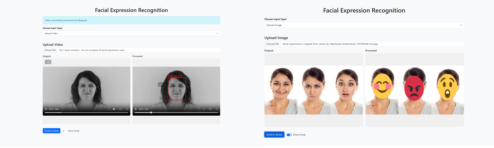
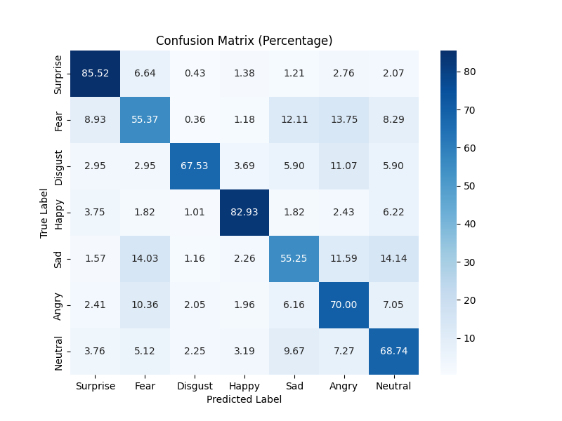

# Facial Expression Recognition 😃😠😢
#### Real-time face detection and emotion classification using **YOLOv11** and **EfficientNet-B0**.



##  🧠 Introduction
Facial emotion recognition (FER) refers to identifying expressions conveying basic emotions such as happiness, sadness, anger, disgust, fear, surprise, and neutrality. Accurate and robust FER is significant for human-computer interaction, clinical practices, marketing analysis, user experience research, and psychological studies.

This project provides an end-to-end pipeline designed for real-time facial expression recognition using YOLOv11 for face detection and EfficientNet-B0 trained on the RAF-DB dataset for emotion classification. The optimized ONNX Runtime enables efficient inference on CPUs and GPUs, providing a seamless user experience.

---

## 🔍 Features
- ⚡ Fast & lightweight: YOLOv11 + EfficientNet-B0
- 🧠 Real-time face detection and emotion classification
- 🌍 Web-based interface with optional emoji overlays
- 💾 ONNX + quantized model for low-power deployment
- ☁️ Live deployment on Google Cloud Run with CI/CD

---

## 📸 Live Demo

This application is **deployed live on [Google Cloud Run](https://cloud.google.com/run)** using a CI/CD pipeline:  
**GitHub → Cloud Build → Cloud Run**  

#### 👉 **Try it now:** 🌐 [Live Demo](https://fer.projects.nishantvalvi.com)

---

## 🏗️ Architecture

The application workflow follows:

```
Input Frame → YOLOv11 (Face Detection) → EfficientNet-B0 (Emotion Classification) → Result Overlay → Web Display
```

## 🗂️ Dataset Information

The project leverages the [RAF-DB dataset](https://www.kaggle.com/datasets/shuvoalok/raf-db-dataset), containing around 15,000 facial images annotated with seven basic emotions:

* 0 - Angry 😠
* 1 - Disgust 😧
* 2 - Fear 😨
* 3 - Happy 😃
* 4 - Sad 😞
* 5 - Surprise 😮
* 6 - Neutral 😐

Images have undergone augmentation methods such as random flips, rotations, and color jitter to enhance the generalization and robustness of the trained model.

---

## 🧰 Installation

1. Clone the repository:

```bash
git clone https://github.com/your-user/Facial_Expression_Recognition.git
cd Facial_Expression_Recognition
```

2. Install dependencies:

```bash
pip install -r requirements.txt
```

3. Obtain pretrained model weights:

* [YOLOv11 Face Detector](https://github.com/akanametov/yolo-face/releases/download/v0.0.0/yolov11n-face.onnx)
* [EfficientNet Emotion Model](https://drive.google.com/uc?export=download&id=1tT8sjm-09ppD-CCzLu0zp8eSjQ37tsjH)

Place these files in `src/models/weights`.

4. Download and extract the RAF-DB dataset into `src/data/data`.

## 🎯 Training:

To train the model:

1. Set `IS_TRAINING: true` in `src/config/custom.yaml`
2. Run:

```bash
python main.py --config src/config/custom.yaml
```

The trained model weights will be saved to `src/models/weights`.

## 🧊 Export to ONNX

Convert your trained PyTorch model to ONNX format for optimized and portable deployment:

```bash
python src/train/export_onnx.py
```


## 🧪 Inference:

1. Set `IS_TRAINING: false` in `src/config/custom.yaml`
2. Run:
```bash
python main.py --config src/config/custom.yaml
```

Alternatively, directly run the FastAPI service:

```bash
uvicorn src.serve.app:app --host 0.0.0.0 --port 8000
```

## 📊 Results & Evaluation

The trained model achieves approximately:

* **Accuracy:** Over 71% test accuracy on RAF-DB.



From the confusion matrix, we can see that the model performs exceptionally well on Surprise, Happy, and Neutral, each showing strong diagonal dominance. However, Fear and Sad exhibit noticeable confusion with neighboring emotions like Angry and Disgust, suggesting that the model struggles to clearly separate these expressions, possibly due to subtle overlaps in facial cues.

## 🚀 Deployment

Build and run the Docker container locally:

```bash
docker build -t fer-app .

# CPU-only execution
docker run -p 8000:8000 fer-app

# GPU acceleration execution
docker run --gpus all -p 8000:8000 fer-app
```

## 🚀 Deployment on Google Cloud Run

This project is deployed using **Google Cloud Run** with a fully automated CI/CD pipeline from GitHub.

Follow these steps to deploy it yourself:

1. **Create a Project** on [Google Cloud Console](https://console.cloud.google.com/).
2. **Enable the following APIs** for the project:
   - Cloud Build API
   - Artifact Registry API
   - Container Analysis API
3. Navigate to **Cloud Run > Create Service**.
4. Choose **"Continuously deploy from a repository (source or function)"**.
5. **Connect your GitHub repository** that contains the Dockerfile.
6. Select the **branch** you want to auto-deploy from (e.g., `main`).
7. Configure the **service settings**:
   - Set the **container port** your app listens on (e.g., `8080`)
   - Choose the appropriate **CPU, memory**, and **instance limits**
8. Click **Create** — this will trigger a Cloud Build that builds and deploys the service.

✅ Once deployed, your app will be live with a secure HTTPS endpoint.  
🌐 [**Live Demo**](https://fer.projects.nishantvalvi.com)
